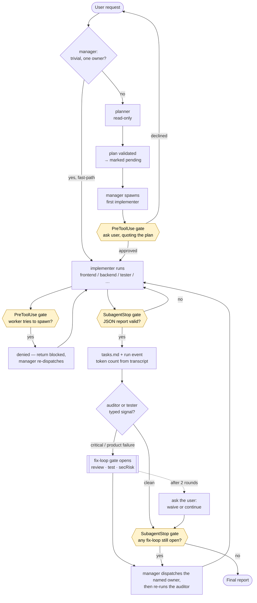

# Agent kit

Portable multi-agent setup for **Claude Code** (CLI and Desktop **Code** tab): manager-orchestrated specialists, call-graph gate, agent-memory, and shared rules.

This folder is a **copy-friendly template**. Drop its contents into a project root, fill in `AGENTS.md`, and edit agents/skills under `.claude/` directly (single tree).

## What you get

| Path | Role |
|------|------|
| `.claude/agents/` | Specialists (`manager`, `planner`, `researcher`, `frontend`, …) — edit here |
| `.claude/skills/` | `manager`, `setup`, `sync-project-skills`, `agent-memory`, `brief-hygiene`, `verify-evidence`, `issue-intake`, … — edit here |
| `.claude/settings.json` | Claude hooks → `.claude/hooks/adapters/claude.mjs` |
| `.claude/protocols/` | Shared worker protocol variants (docs / compose helpers; already expanded into agents) |
| `.claude/rules/` | Always-on: TDD, Karpathy, Context7. Path-only stub: `design-system.md` (via `AGENTS.md` pointer) |
| `.claude/memory/decisions.md` | Append-only product/design decision log |
| `.claude/memory/mcp-usage.md` | Append-only MCP telemetry (server/tool/outcome) |
| `.claude/memory/install-audit.md` | When install kept project `AGENTS.md` / `CLAUDE.md` |
| `.claude/hooks/` | Call-graph gate + worker-report gate core, and the Claude adapter |
| `AGENTS.md` | Shared stack card (customize per project) |
| `CLAUDE.md` | Thin Claude entrypoint pointing at `AGENTS.md` + rules |
| `scripts/sync-tool-adapters.mjs` | Merge settings + refresh `CLAUDE.md` / `--check` roster |
| `scripts/sync-project-skills.mjs` | Inventory kit vs project skills → `AGENTS.md` + `.claude/memory/skills-inventory.md` |
| `.gitignore` | Ignores hook state dirs |

## How a managed run flows



### What each gate actually does

| Gate | Hook | Hard or advisory |
|---|---|---|
| **Nesting** — workers cannot spawn workers | `PreToolUse` on `Agent`/`Task` | **Hard deny.** Fail-closed: an unmapped caller is denied too |
| **Plan approval** — the user sees the plan before implementers start | `PreToolUse` on `Agent`/`Task` | **Ask**, and a strong nudge only — `AGENT_KIT_PLAN_GATE=off`, hook errors, and bypass permission modes all let work through |
| **Access integrity** — no `gh issue` / tracker fetches behind an MCP's back | `PreToolUse` on `Bash` | **Hard deny**, narrowly scoped to kit agents and tracker hosts |
| **Worker report** — every specialist ends with a valid JSON fence | `SubagentStop` | **Blocks** until valid, then goes advisory after 2 retries so one bad worker cannot burn the session |
| **Fix-loops** — a critical finding or a product test failure holds the close | `SubagentStop` | **Blocks** the manager's own stop, capped at 2 rounds. **Only bites when manager runs as a subagent** — as the main agent it is protocol, not enforcement |

Everything else — routing, plan content, evidence truth, PoC exit criteria — is judgment the model owns, and the kit deliberately does not pretend to gate it.

## Feature matrix (Claude Code)

| Feature | Support |
|---------|---------|
| Stack card (`AGENTS.md`) | yes (via `CLAUDE.md` + `AGENTS.md`) |
| Specialist agents | `.claude/agents/` (CLI + Desktop **Code** tab) |
| Skills | `.claude/skills/` |
| Always-on rules | `CLAUDE.md` + `.claude/rules/` |
| Decision memory | `.claude/memory/` |
| Call-graph gate (no worker nesting) | **hard** ×2 (agent `disallowedTools: Agent, Task` + hooks with a routing message; session-scoped state) |
| Worker-report gate (valid JSON fence) | **hard** (`SubagentStop` blocks until schema-valid, capped at 2 retries then advisory) |
| Cited research (`researcher`) | **hard** (`done` requires non-empty `sources`; each needs a title + url/ref) |
| Readonly agents (no file writes) | **soft** (`disallowedTools: Write, Edit, NotebookEdit`; Bash may remain) |
| Sync / install safety | Install copies `.claude/`; merges `settings.json` (does not wipe foreign entries); docs → `docs/agent-kit/` |
| Health check | `node scripts/check-agent-kit.mjs` (roster/settings check + Claude gate smoke + validator) |
| Permission prompts | kit scripts allowlisted via merged `permissions.allow` |

Desktop **Chat** / **Cowork** are out of kit scope.

## Install into a project

Recommended path: install from GitHub into the project root, then ask your agent to run **setup**.

Source: [jamie-l-robertson/agent-kit](https://github.com/jamie-l-robertson/agent-kit).

### Option A — GitHub (recommended)

From your **project root** (requires `curl`, `tar`, `node`):

```bash
curl -fsSL https://raw.githubusercontent.com/jamie-l-robertson/agent-kit/main/scripts/install.sh | bash
```

Optionally pin a branch/tag:

```bash
curl -fsSL https://raw.githubusercontent.com/jamie-l-robertson/agent-kit/main/scripts/install.sh \
  | AGENT_KIT_REF=claude-only bash
```

From a local checkout of this kit:

```bash
/path/to/agent-kit/scripts/install.sh --from=/path/to/agent-kit
```

The installer copies `.claude/`, runtime `scripts/` (not `*.test.mjs`), kit docs into `docs/agent-kit/`, `AGENTS.md`, and `CLAUDE.md`, and merges ignore rules into `.gitignore`. Claude `settings.json` is **merged** (foreign hooks/`permissions`/`env` survive). Existing `AGENTS.md` / `CLAUDE.md` / filled `.claude/rules/*` stubs are **kept** unless you pass `--force`.

Then in the agent chat:

```text
run setup
```

### Host UX (visibility)

- Spawn named kit specialists with short titles; no `[manager] Got it…` / `Dispatching…` chatter.
- Task→`manager` then manager→workers is the normal managed path.
- See `.claude/protocols/host-visibility.md` (composed into manager).

## Customize checklist

- [ ] Run **setup** skill (or fill `AGENTS.md` by hand)
- [ ] If install kept `AGENTS.md` / `CLAUDE.md`: append missing kit sections; check `.claude/memory/install-audit.md`
- [ ] **Commit** `.claude/` after install
- [ ] Optional: pin agent `model:` in `.claude/agents/<name>.md`
- [ ] Optional: **Design system** + standards refs (path or URL; URLs via MCP only)
- [ ] Optional: **Required MCP** / **Standards MCP**

## Editing the kit

Edit under `.claude/` (agents, skills, hooks, memory, rules, protocols, settings).

1. Edit `.claude/agents/`, `.claude/skills/`, `.claude/rules/`, or `.claude/protocols/` as needed.
2. Run `node scripts/sync-tool-adapters.mjs` (settings + `CLAUDE.md`) and/or `node scripts/sync-project-skills.mjs`.
3. Run `node scripts/sync-tool-adapters.mjs --check` and `npm test` / `node scripts/check-agent-kit.mjs`.
