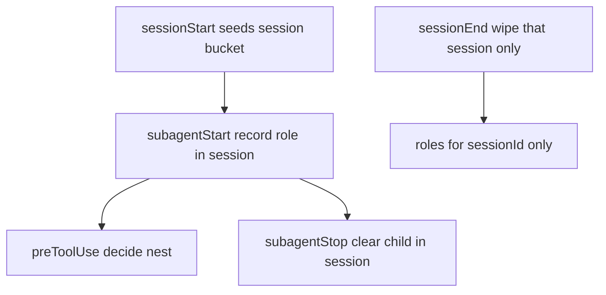

# Address re-rate findings (+ host folders)

**Status:** implemented + almost-closer pass (1A / gate resolve+lock); commits are project-level  
**Source plan:** Cursor plan `address_re-rate_findings`  
**Context:** Post path-to-9–10 re-rate (~7.7 setup / ~7.8 agents). Prior canvas: `kit-rerate-post-910`.

## Todos

- [x] **gate-session** — Session-scoped gate state + `AGENT_KIT_STATE_PATH`; Cursor start deny / stop clear; Claude SessionStart; tests
- [x] **validator-hard** — Evidence on pass/fail; readonly agents; blocked/granted rules; manager always validate; schema drift test
- [x] **install-sync-ship** — Claude merge siblings; deeper `--check`; install script overwrite policy; skill delete by marker; kit-version; README Option C
- [x] **docs-adapters** — Document commit `.cursor/` / `.claude/` / `.github` adapters in kit+consumers; Cursor hard caveat; check-agent-kit messaging

---

## Commit Cursor / Claude / GitHub folders?

**Yes — keep them committed in the kit repo** (already the model: agent files tracked; only hook *state* is gitignored).

| Tree | Role | Commit? |
|------|------|---------|
| `.agents/` | Canonical source | Always |
| `.cursor/` agents, skills, rules, `hooks.json` | Generated Cursor adapters | **Yes** — install/clone works without sync |
| `.claude/` agents, skills, `settings.json` | Generated Claude adapters | **Yes** |
| `.github/agents\|skills\|instructions/` | Generated Copilot adapters | **Yes** (not whole `.github/` — workflows stay project-owned) |
| Hook state | Runtime | **No** (already ignored) |

**Rules:** edit only under `.agents/` → `node scripts/sync-tool-adapters.mjs` → commit both sources and generated trees. CI `check-agent-kit` / `--check` fails on drift.

**Consumers:** after install, **commit** the three host trees so teammates/CI get the same agents without re-running sync. Document in README Customize checklist.

Do **not** switch to “generate-only / don’t commit adapters” — that breaks `AGENT_KIT_REF=main` and Option A install until sync runs.

---

## P0 — Gate safety (all hosts)

Files: `.agents/hooks/gate-core.mjs`, adapters, `scripts/gate-core.test.mjs`, `scripts/check-agent-kit.mjs`.



1. **Session-scoped state** — shape `{ sessions: { [sessionId]: { roles: {} } } }`. `sessionEnd` deletes only that session. Never `roles = {}` globally.
2. **`AGENT_KIT_STATE_PATH`** — honor env for state file; tests + `check-agent-kit` use `mkdtemp` so they never wipe live gate state.
3. **Cursor payload honesty** — stop inventing fields the host doesn’t send:
   - Do not stamp child role onto parent `conversation_id` at Cursor `subagentStart`.
   - Prefer `tool_call_id` / transcript correlation for stop clear when `subagent_id` absent (per Opus).
   - Enable deny on Cursor `subagentStart` (it can deny); keep `preToolUse` as defense in depth.
   - Add `AGENT_KIT_GATE_LOG=1` on Cursor adapter to append normalized payloads for capture.
   - Until real capture exists: README feature matrix — Cursor nest gate **“hard when lifecycle ids present; verify with gate log”** (not unqualified hard).
4. **Claude** — register `SessionStart` in `scripts/merge-host-config.mjs`; SessionEnd already session-wipe after (1).
5. Tests: two-session isolation; check does not touch default `STATE_PATH`; Cursor start deny path.

---

## P0 — Validator hardness

Files: `scripts/validate-worker-report.mjs`, `.agents/schemas/worker-report.schema.json`, tests, `.agents/agents/manager.md`.

- `verificationResult` `pass`|`fail` ⇒ non-empty `evidence`.
- Readonly set: `security`, `risk`, `reviewer`, `planner`, `manager` on `done` ⇒ `mode: audit-only` + `changed: []` (manager reports rare; reject `agent: manager` from workers if simpler).
- `blocked` ⇒ non-empty `needs` or `evidence`.
- `humanApprove: granted` ⇒ non-empty `approvedAction` when destructive (or always require string / `n/a`).
- `recommendNext` empty string invalid; floor `"none"` on `done`.
- Schema `agent.enum` drift-tested against `PROJECT_AGENTS`.
- Manager Integrate: **always** run validator on every fence (drop “when looks wrong”).

---

## P1 — Install / sync / ship

- **Commit + tag** after P0 green (user must ask for commit explicitly when ready); pin `scripts/install.mjs` `DEFAULT_REF` to that tag (or document pin); write `.agents/.kit-version` on install.
- `mergeClaudeSettings`: merge inner `hooks[]` by command — don’t replace whole matcher entry (preserve sibling foreign hooks).
- Deeper `--check`: event-level Cursor hook commands; Claude SessionStart present; recursive skill files.
- Install: preflight JSON parse before copy; **locked:** keep `scripts/` but skip overwrite when dest exists and differs unless `--force`.
- README Option C: don’t copy `*.test.mjs`.
- Stale skill delete: only when `x-owner: agent-kit` marker present (not basename alone).

---

## P2 — Docs / polish

- README: commit host trees in kit + consumers; Cursor caveat; Claude soft-Bash unchanged.
- `check-agent-kit` success line mentions validator; Copilot marker assert fence shape not bare `"status"`.
- Setup skill: remind commit `.cursor/`, `.claude/`, `.github/{agents,skills,instructions}/` after sync.

---

## Verify

```bash
AGENT_KIT_STATE_PATH=/tmp/kit-gate-test node --test scripts/*.test.mjs
node scripts/check-agent-kit.mjs
# assert default STATE_PATH untouched after check
```

Success: concurrent-session test green; check doesn’t clear live state; validator rejects pass-without-evidence + reviewer implement; README/adapters commit policy documented; sync `--check` still green with committed host trees.

---

## Almost-closer pass (post triple re-rate)

- [x] **1A** — `implement` + `done` ⇒ `verificationResult: pass` + non-empty `evidence` (all hosts via shared validator + synced agents)
- [x] **Gate** — `resolveSessionId` via parent/subagent; conversation aliases; exclusive state lock (Cursor + Claude)
- [x] **Copilot** — same report contract in synced `.github/agents`; marker checks for evidence
- [x] **Docs** — README multi-host matrix + Cursor gate-log capture; no setup commit/tag

